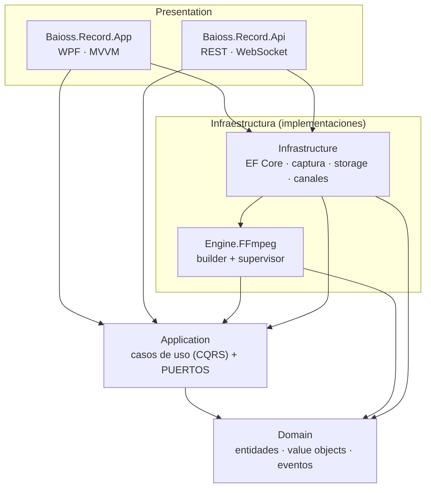
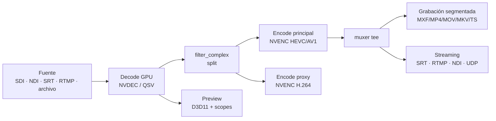

# 01 · Arquitectura

## Principios

1. **Clean Architecture** — la regla de dependencias apunta hacia el dominio. La UI, FFmpeg,
   la base de datos y la red son detalles intercambiables detrás de interfaces (puertos).
2. **Modularidad por interfaces** — cada módulo (Captura, Grabación, Preview, Streaming,
   Almacenamiento, Scheduler, Monitoreo, Metadata, FFmpeg, DeckLink, NDI, SRT, API, Auth)
   se define como un puerto en `Application` y se implementa en una capa externa.
3. **Aislamiento por canal** — cada canal es una unidad autónoma (proceso FFmpeg + watchdog +
   sesión propios). No comparten estado mutable: A y B escalan y fallan de forma independiente.
4. **CQRS donde aporta** — comandos (mutación) y queries (lectura) separados; la API y la UI
   despachan los mismos casos de uso.
5. **Estabilidad 24/7 primero** — toda ruta crítica asume reinicios, pérdida de señal y
   cortes de energía como estados normales, no como excepciones.

## Capas y regla de dependencias

`Domain` no referencia nada. `Application` solo referencia `Domain`. Las capas externas
implementan los puertos de `Application` y se inyectan por DI en el composition root (`App`).

## Mapa de módulos → puertos → implementación

| Módulo | Puerto (Application) | Implementación |
|--------|----------------------|----------------|
| Core / Orquestación | `IChannelEngine`, `IChannelManager` | `Infrastructure/Channels/*` |
| Capture | `ICaptureSource`, `ICaptureSourceFactory`, `IDeviceEnumerator` | `Infrastructure/Capture/*` (DeckLink, NDI, SRT, RTMP, File, DShow) |
| Signal | `ISignalMonitor` | `Infrastructure/Capture/SignalMonitor` |
| Recording | `IRecorderEngine`, `ISegmenter`, `ISnapshotService`, `IProxyGenerator` | `Engine.FFmpeg/*` |
| Preview | `IPreviewEngine` | `Infrastructure/Preview` (D3D11 + scopes FFmpeg) |
| Streaming | `IStreamingPublisher`, `IStreamingPublisherFactory` | rama `tee` del proceso FFmpeg |
| Storage | `IStorageManager` | `Infrastructure/Storage/StorageManager` |
| Scheduler | `ISchedulerService` | `Infrastructure/Scheduling` (BackgroundService) |
| Monitoring | `IPerformanceMonitor` | `Infrastructure/Monitoring` (NVML/PDH) |
| Metadata | `IMetadataExporter` | `Infrastructure/Metadata` (XML/JSON/CSV) |
| FFmpeg Engine | `IFfmpegLocator` | `Engine.FFmpeg` |
| Persistence | `IRepository<T>`, `IUnitOfWork` | `Infrastructure/Persistence` (EF Core) |
| API | (host) | `Api/ApiEndpoints` |
| Auth | `IAuthenticationService`, `IAuthorizationPolicy` | `Infrastructure/Security` |
| Eventos | `IEventBus` | `Infrastructure/Messaging` (canal in-process → WebSocket) |

## Pipeline interno de un canal

Un único proceso FFmpeg por canal hace decode → split → encode → grabación + streaming
**simultáneos** (muxer `tee`), más el proxy como salida adicional. El preview corre por una
ruta de baja latencia separada para no acoplar su cadencia a la del encoder de grabación.

## Procesos en ejecución (background services)

El host (`App` o un Windows Service en modo headless) levanta servicios de fondo:

- **ChannelEngine ×N** — orquesta cada canal.
- **SchedulerHostedService** — dispara trabajos por fecha/hora/CRON.
- **RetentionHostedService** — aplica auto-delete/archivado (7/30/90/personalizado).
- **PerformanceMonitorHostedService** — publica CPU/RAM/GPU/VRAM/Disco/Red.
- **ContinuousRecordingHostedService** — re-arma sesiones 24/7 tras reinicio del host.
- **API (Kestrel embebido)** — REST + WebSocket de eventos.

## Tecnologías transversales

- **Logging**: Serilog (sink de archivo con rolling diario; opcional Seq/Elastic en empresa).
- **Concurrencia**: `async`/`await`, `Channel<T>` para telemetría, un proceso FFmpeg por canal.
- **Hardware**: NVENC/NVDEC/AV1, AMF, QuickSync vía FFmpeg; NVML para métricas de GPU.
- **Interop preview**: textura D3D11 compartida → `D3DImage` en WPF (cero copias a CPU).
