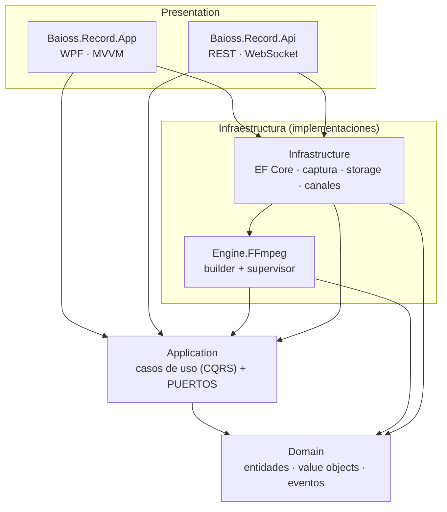
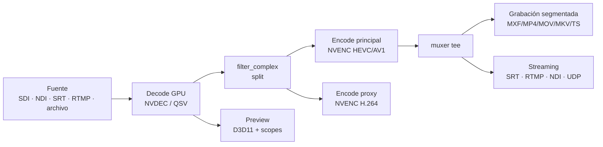

# 01 · Arquitectura

## Principios

1. **Clean Architecture** — la regla de dependencias apunta hacia el dominio. La UI, FFmpeg,
   la base de datos y la red son detalles intercambiables detrás de interfaces (puertos).
2. **Modularidad por interfaces** — cada módulo (Captura, Grabación, Preview, Streaming,
   Almacenamiento, Scheduler, Monitoreo, Metadata, FFmpeg, DeckLink, NDI, SRT, API, Auth)
   se define como un puerto en `Application` y se implementa en una capa externa.
3. **Aislamiento por canal** — cada canal es una unidad autónoma (proceso FFmpeg + watchdog +
   sesión propios). No comparten estado mutable: A y B escalan y fallan de forma independiente.
4. **CQRS donde aporta** — comandos (mutación) y queries (lectura) separados; la API y la UI
   despachan los mismos casos de uso.
5. **Estabilidad 24/7 primero** — toda ruta crítica asume reinicios, pérdida de señal y
   cortes de energía como estados normales, no como excepciones.

## Capas y regla de dependencias

```mermaid
flowchart TD
    subgraph Presentation
        APP["Baioss.Record.App<br/>WPF · MVVM"]
        API["Baioss.Record.Api<br/>REST · WebSocket"]
    end
    subgraph Infra["Infraestructura (implementaciones)"]
        ENG["Engine.FFmpeg<br/>builder + supervisor"]
        INF["Infrastructure<br/>EF Core · captura · storage · canales"]
    end
    APPL["Application<br/>casos de uso (CQRS) + PUERTOS"]
    DOM["Domain<br/>entidades · value objects · eventos"]

    APP --> APPL
    API --> APPL
    APP --> INF
    API --> INF
    INF --> ENG
    ENG --> APPL
    INF --> APPL
    APPL --> DOM
    ENG --> DOM
    INF --> DOM
```

`Domain` no referencia nada. `Application` solo referencia `Domain`. Las capas externas
implementan los puertos de `Application` y se inyectan por DI en el composition root (`App`).

## Mapa de módulos → puertos → implementación

| Módulo | Puerto (Application) | Implementación |
|--------|----------------------|----------------|
| Core / Orquestación | `IChannelEngine`, `IChannelManager` | `Infrastructure/Channels/*` |
| Capture | `ICaptureSource`, `ICaptureSourceFactory`, `IDeviceEnumerator` | `Infrastructure/Capture/*` (DeckLink, NDI, SRT, RTMP, File, DShow) |
| Signal | `ISignalMonitor` | `Infrastructure/Capture/SignalMonitor` |
| Recording | `IRecorderEngine`, `ISegmenter`, `ISnapshotService`, `IProxyGenerator` | `Engine.FFmpeg/*` |
| Preview | `IPreviewEngine` | `Infrastructure/Preview` (D3D11 + scopes FFmpeg) |
| Streaming | `IStreamingPublisher`, `IStreamingPublisherFactory` | rama `tee` del proceso FFmpeg |
| Storage | `IStorageManager` | `Infrastructure/Storage/StorageManager` |
| Scheduler | `ISchedulerService` | `Infrastructure/Scheduling` (BackgroundService) |
| Monitoring | `IPerformanceMonitor` | `Infrastructure/Monitoring` (NVML/PDH) |
| Metadata | `IMetadataExporter` | `Infrastructure/Metadata` (XML/JSON/CSV) |
| FFmpeg Engine | `IFfmpegLocator` | `Engine.FFmpeg` |
| Persistence | `IRepository<T>`, `IUnitOfWork` | `Infrastructure/Persistence` (EF Core) |
| API | (host) | `Api/ApiEndpoints` |
| Auth | `IAuthenticationService`, `IAuthorizationPolicy` | `Infrastructure/Security` |
| Eventos | `IEventBus` | `Infrastructure/Messaging` (canal in-process → WebSocket) |

## Pipeline interno de un canal

```mermaid
flowchart LR
    SRC["Fuente<br/>SDI · NDI · SRT · RTMP · archivo"] --> DEC["Decode GPU<br/>NVDEC / QSV"]
    DEC --> SPLIT["filter_complex<br/>split"]
    SPLIT --> ENCV["Encode principal<br/>NVENC HEVC/AV1"]
    SPLIT --> PRX["Encode proxy<br/>NVENC H.264"]
    DEC --> PV["Preview<br/>D3D11 + scopes"]
    ENCV --> TEE["muxer tee"]
    TEE --> REC["Grabación segmentada<br/>MXF/MP4/MOV/MKV/TS"]
    TEE --> STR["Streaming<br/>SRT · RTMP · NDI · UDP"]
```

Un único proceso FFmpeg por canal hace decode → split → encode → grabación + streaming
**simultáneos** (muxer `tee`), más el proxy como salida adicional. El preview corre por una
ruta de baja latencia separada para no acoplar su cadencia a la del encoder de grabación.

**Entradas de red (SRT/RTMP) y relevo sin corte.** Grabar y Detener reconstruyen el proceso del canal. Con un
dispositivo abierto directamente por ese proceso (DirectShow; DeckLink sin relé) eso obliga a cerrar el proceso viejo
antes de abrir el nuevo (una sola apertura).
Con una entrada de red, en cambio, un `NetworkStreamReceiver` permanente mantiene la conexión con el emisor y empuja
el MPEG-TS a un `NetworkStreamRelay` loopback que lo reparte a varios consumidores con una ventana de pre-roll desde un
fotograma clave: el emisor nunca ve un corte y la grabación empieza unos segundos antes del botón. Sobre ese relé el
motor (`FfmpegChannelEngine`) hace el **relevo**: arranca el proceso nuevo mientras el viejo sigue pintando, el preview
del nuevo se salta el pre-roll (que la grabación sí conserva), y solo le cede la imagen cuando el relé confirma que ya
lee en directo (`RelayReservation.IsLive`, sostenido 1 s) y sus frames llegan a la cadencia real; entonces retira el
viejo (si grababa, finaliza su archivo). Resultado: ni congelación ni avance rápido al Grabar/Detener
(`NetworkPreviewContinuityTests` lo mide con el motor real y un emisor RTMP local).

**DeckLink: dispositivo persistente con relé en crudo.** La tarjeta es exclusiva y reabrirla cuesta 0,3–1 s sin frames
(más con autodetección; con el conector bidireccional de la Duo 2, la resincronización del receptor SDI), así que con la
captura directa cada Grabar/Detener congelaba el preview y grababa unas décimas de negro al principio. Desde 2026-09-27
(`Capture:DecklinkRelay`, activado por defecto) un `RawCaptureReceiver` permanente abre la tarjeta una sola vez
(`-f decklink … -c copy -f nut`) y empuja la señal EN CRUDO (el vídeo tal cual lo entrega la tarjeta y el PCM, con sus
marcas de tiempo, en un contenedor NUT) a un `RawStreamRelay` loopback; el proceso del canal la lee de ahí
(`-f nut -i tcp://127.0.0.1:…`) y el motor aplica el mismo relevo que con las entradas de red. Diferencias con el relé
de red: el flujo son 100–250 MB/s por canal, así que se trocea con `NutStreamReader` en unidades enteras (paquetes y
frames) que se reparten por referencia desde un pool (un frame de 4 MB no se copia por consumidor ni se reserva en el
heap grande); un consumidor nuevo recibe primero las cabeceras del flujo y arranca en el siguiente punto de sincronía
tras conectar (sin pre-roll: en crudo cada frame es clave, y un atraso acumulado mientras el proceso arranca serían
decenas de MB que digerir); «al día» es un atraso de como mucho dos frames (con escrituras de 4 MB, «nada pendiente» no
se da ni en tiempo real); y un consumidor atascado pierde frames enteros (su cola se acota en bytes), nunca la
sincronía. La señal la dicta el receptor a partir del stderr de FFmpeg: abriendo la tarjeta → abierta con el formato
real → sin señal en la entrada («No input signal detected» / «Input returned», ahora detectados en caliente) / tarjeta
en uso / sin detección / reabriendo. El sondeo de recuperación del slate usa `ICaptureSource.BuildProbeArguments` (lee
del relé sin reservar consumidor y solo si el receptor ve señal). Si el proceso de captura muere, el relé cierra a los
consumidores (EOF), el supervisor lo relanza y el canal se recupera solo; el bucle de espera de señal del motor se
despierta en cuanto la fuente pasa a SEÑAL OK (antes tardaba hasta 5 s). Medido con una tarjeta sintética (lavfi en
tiempo real) en `DecklinkRelayContinuityTests`: Grabar/Detener sin ningún hueco de preview y sin reabrir la tarjeta,
caída del proceso de captura con recuperación sola, 1080p con 8 canales de audio, y con `BAIOSS_RELAY_PERF=1` el coste
del relé: 1 GB de NUT de 1080p25 a doble velocidad de tarjeta (207 MB/s) sin descartar nada, 0,19 núcleos por canal
a tiempo real con origen y consumidor incluidos (i5-10300H). Coste de los procesos, medido con un flujo 1080i59.94
uyvy422 + 16 canales (120 MB/s): receptor `-c copy -f nut` 0,10 núcleos y 18 MB; demultiplexar NUT en el proceso del
canal 0,03 núcleos (menos que leer del disco). En total unos 0,25 núcleos y 40 MB más por canal 1080i que la captura
directa, sin GPU ni disco; 4 canales son ≈ 1 núcleo y 0,5 GB/s de loopback. Validado con la Duo 2 real el
2026-09-27: 4 canales con 16 canales de audio grabando a 30/30 fps sin descartes y sin que ningún receptor se relance.
`Capture:DecklinkRelay=false` devuelve la captura directa.

**Cuánto tarda Detener (y dónde mirar).** Con relevo, Detener espera a que el preview nuevo tome el mando: con una
entrada de red, 1 s de directo confirmado + 0,5 s de cadencia (≈ 2–2,7 s; hasta 10 s de `SettleTimeout` o 15 s de
`HandoffTimeout` si la máquina va saturada y el proceso nuevo no llega a «al día»), porque su entrada trae pre-roll
(`ICaptureSource.DeliversPreroll`); con el relé en crudo de DeckLink no hay pre-roll y el relevo se hace con el primer
frame del proceso nuevo (≈ 0,5–1 s; antes esperaba el mismo «al día sostenido» y en producción, con 4 canales
grabando, Detener tardaba 15 s). Luego envía la «q» al grabador y espera a que FFmpeg cierre el archivo (hasta
`GracefulTimeout`, 30 s; si vence, lo mata y avisa «FFmpeg no finalizó en…»), emite el segmento, espera su fila en la
BD y publica `RecordingStopped` (el bus espera a la auditoría y al WebSocket del panel). Solo entonces la aplicación
abre el diálogo del nombre. Medido con contenido fabricado (i5-10300H, GTX 1650 Ti, NVMe): el cierre del archivo en
sí NO crece con las horas (MXF MPEG-2 + PCM de 3 h y 7 GB en 0,11 s; MP4 estándar con vídeo 59.94 fps y 8 pistas AAC
de 3 h codificado con x264 en 0,10 s: el `moov` de 4 millones de muestras es cuestión de milisegundos; un archivo de
3,5 GB se cierra en 0,12 s con Defender activo), pero **el cierre de `h264_nvenc` sí**: con el mismo MP4 de 8 pistas,
FFmpeg tarda en salir 0,6 s tras 1 h de contenido, 2,2 s tras 2 h y 4,0 s tras 3 h (superlineal; con 20 s o 5 min de
contenido, 0,24 s), y ese tiempo lo espera Detener. Lo que puede alargarlo además en producción y no depende del
motor: un antivirus que escanea el archivo al cerrarlo (crece con el tamaño), SQLite bloqueada por otro escritor
(hasta 30 s) o un cliente del panel web que no lee.
Para saberlo sin adivinar, el registro deja dos líneas por cada Detener: «Canal X: relevo del preview en A s y archivo
cerrado en B s» (motor) y «Canal X: grabación detenida en T s (motor, base de datos, eventos)» (canal).

**Colchón de preview (`PreviewPacer`).** El preview pinta cada frame según llega; una fuente que entrega a ráfagas
(un servidor RTMP que se para y luego descarga de golpe) se ve a saltos aunque el motor esté sano. Por eso cada
fuente de red admite un colchón opcional (Entradas → Fuentes de red → «Colchón de preview», 0 = sin colchón): los
frames se encolan tal como llegan y un hilo propio los entrega a la cadencia nominal de la fuente con ese retardo,
manteniendo el último frame en un hueco, corrigiendo la deriva con un frame repetido o descartado cada cinco entregas
fuera de una banda muerta (mitad y doble del objetivo) y acotando la cola (descarta lo más viejo) ante una ráfaga mayor
que el colchón. Está por encima de los sumideros de proceso, así que un relevo no lo vacía; y no toca la grabación.
Medido con el servidor real del usuario (paradas de hasta 1,8 s): de 27 fps con huecos a 29–30 frames por segundo
exactos con 2 s de colchón (`NetworkPreviewCushionTests`: banco con proxy a ráfagas y sonda contra una URL real).

## Procesos en ejecución (background services)

El host (`App` o un Windows Service en modo headless) levanta servicios de fondo:

- **ChannelEngine ×N** — orquesta cada canal.
- **SchedulerHostedService** — dispara trabajos por fecha/hora/CRON.
- **RetentionHostedService** — aplica auto-delete/archivado (7/30/90/personalizado).
- **PerformanceMonitorHostedService** — publica CPU/RAM/GPU/VRAM/Disco/Red.
- **ContinuousRecordingHostedService** — re-arma sesiones 24/7 tras reinicio del host.
- **API (Kestrel embebido)** — REST + WebSocket de eventos.

## Tecnologías transversales

- **Logging**: Serilog (sink de archivo con rolling diario; opcional Seq/Elastic en empresa).
- **Concurrencia**: `async`/`await`, `Channel<T>` para telemetría, un proceso FFmpeg por canal. La salida
  (stdout/stderr) de todo proceso hijo de larga vida se lee con `ProcessOutput` (un hilo propio por flujo), nunca con
  `Process.BeginOutputReadLine`: en Windows esas tuberías son síncronas y cada lectura «asíncrona» secuestra un hilo
  del pool mientras espera; con varios FFmpeg vivos el pool se agotaba y toda la app (preview, relé, API) se paraba
  varios segundos en cada Grabar/Detener.
- **Hardware**: NVENC/NVDEC/AV1, AMF, QuickSync vía FFmpeg; NVML para métricas de GPU.
- **Interop preview**: textura D3D11 compartida → `D3DImage` en WPF (cero copias a CPU).
