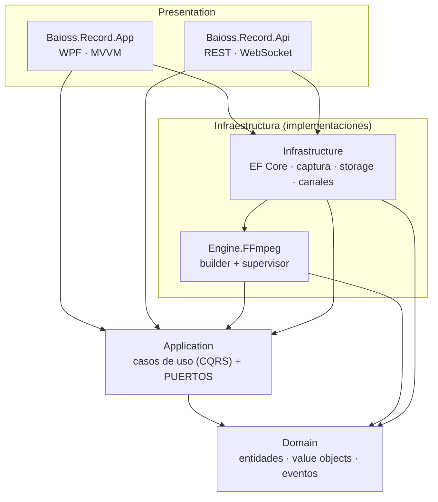
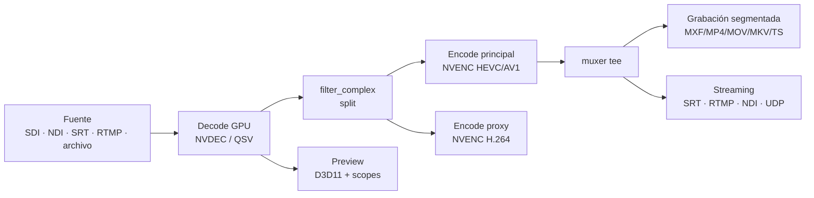

# 01 · Arquitectura

## Principios

1. **Clean Architecture** — la regla de dependencias apunta hacia el dominio. La UI, FFmpeg,
   la base de datos y la red son detalles intercambiables detrás de interfaces (puertos).
2. **Modularidad por interfaces** — cada módulo (Captura, Grabación, Preview, Streaming,
   Almacenamiento, Scheduler, Monitoreo, Metadata, FFmpeg, DeckLink, NDI, SRT, API, Auth)
   se define como un puerto en `Application` y se implementa en una capa externa.
3. **Aislamiento por canal** — cada canal es una unidad autónoma (proceso FFmpeg + watchdog +
   sesión propios). No comparten estado mutable: A y B escalan y fallan de forma independiente.
4. **CQRS donde aporta** — comandos (mutación) y queries (lectura) separados; la API y la UI
   despachan los mismos casos de uso.
5. **Estabilidad 24/7 primero** — toda ruta crítica asume reinicios, pérdida de señal y
   cortes de energía como estados normales, no como excepciones.

## Capas y regla de dependencias

```mermaid
flowchart TD
    subgraph Presentation
        APP["Baioss.Record.App<br/>WPF · MVVM"]
        API["Baioss.Record.Api<br/>REST · WebSocket"]
    end
    subgraph Infra["Infraestructura (implementaciones)"]
        ENG["Engine.FFmpeg<br/>builder + supervisor"]
        INF["Infrastructure<br/>EF Core · captura · storage · canales"]
    end
    APPL["Application<br/>casos de uso (CQRS) + PUERTOS"]
    DOM["Domain<br/>entidades · value objects · eventos"]

    APP --> APPL
    API --> APPL
    APP --> INF
    API --> INF
    INF --> ENG
    ENG --> APPL
    INF --> APPL
    APPL --> DOM
    ENG --> DOM
    INF --> DOM
```

`Domain` no referencia nada. `Application` solo referencia `Domain`. Las capas externas
implementan los puertos de `Application` y se inyectan por DI en el composition root (`App`).

## Mapa de módulos → puertos → implementación

| Módulo | Puerto (Application) | Implementación |
|--------|----------------------|----------------|
| Core / Orquestación | `IChannelEngine`, `IChannelManager` | `Infrastructure/Channels/*` |
| Capture | `ICaptureSource`, `ICaptureSourceFactory`, `IDeviceEnumerator` | `Infrastructure/Capture/*` (DeckLink, NDI, SRT, RTMP, File, DShow) |
| Signal | `ISignalMonitor` | `Infrastructure/Capture/SignalMonitor` |
| Recording | `IRecorderEngine`, `ISegmenter`, `ISnapshotService`, `IProxyGenerator` | `Engine.FFmpeg/*` |
| Preview | `IPreviewEngine` | `Infrastructure/Preview` (D3D11 + scopes FFmpeg) |
| Streaming | `IStreamingPublisher`, `IStreamingPublisherFactory` | rama `tee` del proceso FFmpeg |
| Storage | `IStorageManager` | `Infrastructure/Storage/StorageManager` |
| Scheduler | `ISchedulerService` | `Infrastructure/Scheduling` (BackgroundService) |
| Monitoring | `IPerformanceMonitor` | `Infrastructure/Monitoring` (NVML/PDH) |
| Metadata | `IMetadataExporter` | `Infrastructure/Metadata` (XML/JSON/CSV) |
| FFmpeg Engine | `IFfmpegLocator` | `Engine.FFmpeg` |
| Persistence | `IRepository<T>`, `IUnitOfWork` | `Infrastructure/Persistence` (EF Core) |
| API | (host) | `Api/ApiEndpoints` |
| Auth | `IAuthenticationService`, `IAuthorizationPolicy` | `Infrastructure/Security` |
| Eventos | `IEventBus` | `Infrastructure/Messaging` (canal in-process → WebSocket) |

## Pipeline interno de un canal

```mermaid
flowchart LR
    SRC["Fuente<br/>SDI · NDI · SRT · RTMP · archivo"] --> DEC["Decode GPU<br/>NVDEC / QSV"]
    DEC --> SPLIT["filter_complex<br/>split"]
    SPLIT --> ENCV["Encode principal<br/>NVENC HEVC/AV1"]
    SPLIT --> PRX["Encode proxy<br/>NVENC H.264"]
    DEC --> PV["Preview<br/>D3D11 + scopes"]
    ENCV --> TEE["muxer tee"]
    TEE --> REC["Grabación segmentada<br/>MXF/MP4/MOV/MKV/TS"]
    TEE --> STR["Streaming<br/>SRT · RTMP · NDI · UDP"]
```

Un único proceso FFmpeg por canal hace decode → split → encode → grabación + streaming
**simultáneos** (muxer `tee`), más el proxy como salida adicional. El preview corre por una
ruta de baja latencia separada para no acoplar su cadencia a la del encoder de grabación.

**Entradas de red (SRT/RTMP) y relevo sin corte.** Grabar y Detener reconstruyen el proceso del canal. Con un
dispositivo (DeckLink, DirectShow) eso obliga a cerrar el proceso viejo antes de abrir el nuevo (una sola apertura).
Con una entrada de red, en cambio, un `NetworkStreamReceiver` permanente mantiene la conexión con el emisor y empuja
el MPEG-TS a un `NetworkStreamRelay` loopback que lo reparte a varios consumidores con una ventana de pre-roll desde un
fotograma clave: el emisor nunca ve un corte y la grabación empieza unos segundos antes del botón. Sobre ese relé el
motor (`FfmpegChannelEngine`) hace el **relevo**: arranca el proceso nuevo mientras el viejo sigue pintando, el preview
del nuevo se salta el pre-roll (que la grabación sí conserva), y solo le cede la imagen cuando el relé confirma que ya
lee en directo (`RelayReservation.IsLive`, sostenido 1 s) y sus frames llegan a la cadencia real; entonces retira el
viejo (si grababa, finaliza su archivo). Resultado: ni congelación ni avance rápido al Grabar/Detener
(`NetworkPreviewContinuityTests` lo mide con el motor real y un emisor RTMP local).

**Colchón de preview (`PreviewPacer`).** El preview pinta cada frame según llega; una fuente que entrega a ráfagas
(un servidor RTMP que se para y luego descarga de golpe) se ve a saltos aunque el motor esté sano. Por eso cada
fuente de red admite un colchón opcional (Entradas → Fuentes de red → «Colchón de preview», 0 = sin colchón): los
frames se encolan tal como llegan y un hilo propio los entrega a la cadencia nominal de la fuente con ese retardo,
manteniendo el último frame en un hueco, corrigiendo la deriva con un frame repetido o descartado cada cinco entregas
fuera de una banda muerta (mitad y doble del objetivo) y acotando la cola (descarta lo más viejo) ante una ráfaga mayor
que el colchón. Está por encima de los sumideros de proceso, así que un relevo no lo vacía; y no toca la grabación.
Medido con el servidor real del usuario (paradas de hasta 1,8 s): de 27 fps con huecos a 29–30 frames por segundo
exactos con 2 s de colchón (`NetworkPreviewCushionTests`: banco con proxy a ráfagas y sonda contra una URL real).

**Grabación robusta con archivos normales (desde 2026-09-26).** Con `Recording:FragmentedMp4 = true` (ahora el
valor de la compilación) cada pieza MP4/MOV se escribe FRAGMENTADA (índice al inicio + fragmentos de ≤ 1 s): una
caída del proceso pierde como mucho un segundo, no la pieza (el incidente 2026-09-06 costó un segmento de 22 min
grabado en MP4 estándar). Y para que los archivos queden «normales» —duración en el Explorador, búsqueda exacta—,
cada segmento se FINALIZA al cerrarse: `ScanSegments` lo emite con `optimizeSeek` y `VerifyRecordingAsync` lo
verifica con ffprobe y lo remuxea a MP4 estándar con `+faststart` (`FfmpegLocator.RemuxFaststartAsync`: copia sin
recodificar a un temporal `*.faststart.tmp` en la misma carpeta —que el escaneo de segmentos no ve— y sustitución
atómica; si el original está abierto por otro, reintenta y si no puede lo deja fragmentado, que sigue siendo válido).
Uno a la vez en toda la aplicación (`RemuxGate`) y a prioridad baja, para no competir con las grabaciones por el
disco; acotado por `Recording:FaststartMaxGB` (por encima la pieza queda fragmentada). El archivo único se finaliza al
detener, como antes. El renombrado al detener espera a las finalizaciones en vuelo. `SegmentFinalizeTests` lo cubre.
Una pieza que una caída deja SIN contenido reproducible (el proceso murió con el archivo recién abierto o a mitad del
primer fragmento: menos de 4 MB y ffprobe no la lee) se descarta al emitirla, con aviso en el registro y sin fila de
segmento ni alarma: no es una grabación, y la caída ya consta como `RecordingInterrupted`. Las piezas grandes que no se
verifican sí se conservan y alarman (ahí hay material que recuperar).

**Pruebas de estrés (`StressTests`, con `BAIOSS_STRESS=1`).** Cuatro canales grabando dos minutos con segmentación,
finalización y clips concurrentes; veinte ciclos rápidos de Grabar/Detener; cinco caídas provocadas del proceso de
grabación; y una entrada RTMP a ráfagas con relevos, clips y dos caídas del emisor. Cada escenario comprueba, además de
los archivos, que no queden procesos ffmpeg huérfanos, hilos, descriptores ni memoria de más, ni temporales de remux.

**Clip de la grabación en curso (`ClipPlanner` + `ClipExtractor`).** «✂ Clip» (o `POST /channels/{id}/clip`) copia los
últimos 30 s / 1 / 5 / 10 min de la grabación EN CURSO a `clips/` sin detenerla ni recodificar: otro ffmpeg lee el
archivo que aún se escribe. Solo con contenedores legibles mientras crecen, MP4 fragmentado (el modo robusto por
defecto) y TS; MXF no tiene índice hasta cerrarse y el MP4 estándar no tiene `moov` (`IClipExtraction.CanExtractClip`
lo dice y el botón no se ofrece). El corte empieza en el fotograma clave anterior al instante pedido (buscado con
`ffprobe -read_intervals`, sin leer el archivo entero) y termina 1,2 s (fMP4) o 0,5 s (TS) antes de la duración
legible, porque el último fragmento puede estar a medias. Con grabación segmentada el clip cruza segmentos en dos
pasos: la cola del primero desde el keyframe a una pieza temporal y luego `concat` sin buscar (el demuxer `concat` no
sabe buscar dentro de un fMP4 recién abierto: copiaba desde el principio del segmento, medido). Un clip a la vez por
canal, comprobación de espacio por el bitrate real, verificación con ffprobe y evento `ClipExtracted` en la auditoría
(`ClipExtractionTests` lo cubre con el motor real: fMP4, TS, segmentado y los casos que no se pueden).

## Procesos en ejecución (background services)

El host (`App` o un Windows Service en modo headless) levanta servicios de fondo:

- **ChannelEngine ×N** — orquesta cada canal.
- **SchedulerHostedService** — dispara trabajos por fecha/hora/CRON.
- **RetentionHostedService** — aplica auto-delete/archivado (7/30/90/personalizado).
- **PerformanceMonitorHostedService** — publica CPU/RAM/GPU/VRAM/Disco/Red.
- **ContinuousRecordingHostedService** — re-arma sesiones 24/7 tras reinicio del host.
- **API (Kestrel embebido)** — REST + WebSocket de eventos.

## Tecnologías transversales

- **Logging**: Serilog (sink de archivo con rolling diario; opcional Seq/Elastic en empresa).
- **Concurrencia**: `async`/`await`, `Channel<T>` para telemetría, un proceso FFmpeg por canal. La salida
  (stdout/stderr) de todo proceso hijo de larga vida se lee con `ProcessOutput` (un hilo propio por flujo), nunca con
  `Process.BeginOutputReadLine`: en Windows esas tuberías son síncronas y cada lectura «asíncrona» secuestra un hilo
  del pool mientras espera; con varios FFmpeg vivos el pool se agotaba y toda la app (preview, relé, API) se paraba
  varios segundos en cada Grabar/Detener.
- **Hardware**: NVENC/NVDEC/AV1, AMF, QuickSync vía FFmpeg; NVML para métricas de GPU.
- **Interop preview**: textura D3D11 compartida → `D3DImage` en WPF (cero copias a CPU).
