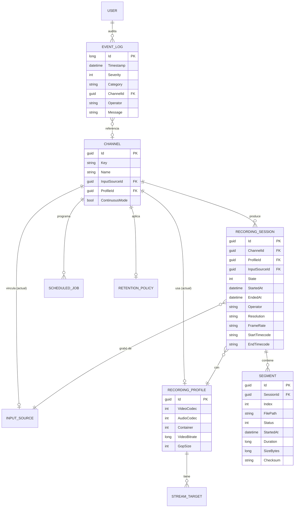

# 03 · Modelo de datos

## Diagrama entidad-relación



## Entidades núcleo

- **Channel** — canal independiente (A/B/…). Mantiene fuente y perfil activos y la bandera 24/7.
- **InputSource** — definición de entrada (tipo + URI + parámetros por protocolo).
- **RecordingProfile** — "receta" de codificación: códecs, bitrate, GOP, contenedor, overlays,
  más sub-políticas `SegmentationPolicy`, `ProxyProfile` y lista de `StreamTarget`.
- **RecordingSession** — lapso Start→Stop. Agrupa segmentos y concentra la metadata exportable.
- **Segment** — archivo físico; la secuencia ordenada por `Index` reconstruye la continuidad.
- **ScheduledJob** — trabajo del scheduler (start/stop, cambio de perfil/fuente, CRON opcional).
- **RetentionPolicy** — días de retención + acción (borrar/archivar).
- **EventLogEntry** — append-only; eventos técnicos + auditoría.
- **User** — usuario con rol (Administrador/Supervisor/Operador), contraseña como hash+salt.

## Esquema físico

El mismo modelo EF Core corre sobre **SQLite** (instalación local, single-box) o
**PostgreSQL** (multi-nodo/empresa). Solo cambia el provider en DI:

```csharp
// Local
services.AddDbContext<BaiossDbContext>(o => o.UseSqlite("Data Source=baioss.db"));
// Empresa
services.AddDbContext<BaiossDbContext>(o => o.UseNpgsql(cfg.GetConnectionString("Pg")));
```

Índices clave:

- `Segment (SessionId, Index)` único → garantiza orden y detecta huecos de continuidad.
- `EventLogEntry (Timestamp)` → consultas de auditoría por rango temporal.
- `User (Username)` único.

> La metadata libre de la sesión y los parámetros por protocolo se persisten como JSON
> (columnas `jsonb` en PostgreSQL; `TEXT` con conversión en SQLite).

## Continuidad e índice de segmentos

Cada `RecordingSession` produce un **sidecar de índice** (`<session>.index.json`) que lista
los segmentos con `Index`, `FilePath`, timecodes de inicio/fin y duración. Permite:

- **Auto-merge** — concatenar segmentos a un máster sin recodificar (`-f concat -c copy`).
- **Export timeline** — generar EDL/AAF/FCPXML para edición.
- **Detección de huecos** — un salto en `Index` o en timecode marca un segmento perdido.

## Metadata exportable (XML / JSON / CSV)

Por sesión se exporta: fecha, hora, operador, canal, fuente, duración, códec, resolución,
fps, layout de audio, bitrate, timecode inicial y final. Ejemplo JSON:

```json
{
  "sessionId": "8f3c…",
  "channel": "A",
  "operator": "jcruz",
  "source": { "type": "DecklinkSdi", "uri": "DeckLink 8K Pro (1)" },
  "startedAt": "2026-06-16T14:00:00Z",
  "endedAt": "2026-06-16T15:00:00Z",
  "duration": "01:00:00",
  "video": { "codec": "HevcNvenc", "resolution": "1920x1080", "fps": "25", "bitrate": "50 Mbps" },
  "audio": { "codec": "Pcm", "layout": "Stereo", "sampleRate": 48000 },
  "timecode": { "start": "10:00:00:00", "end": "11:00:00:00", "dropFrame": false },
  "segments": 4
}
```
