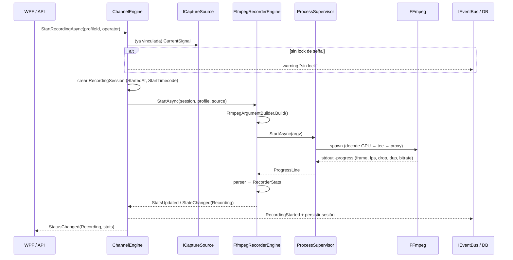
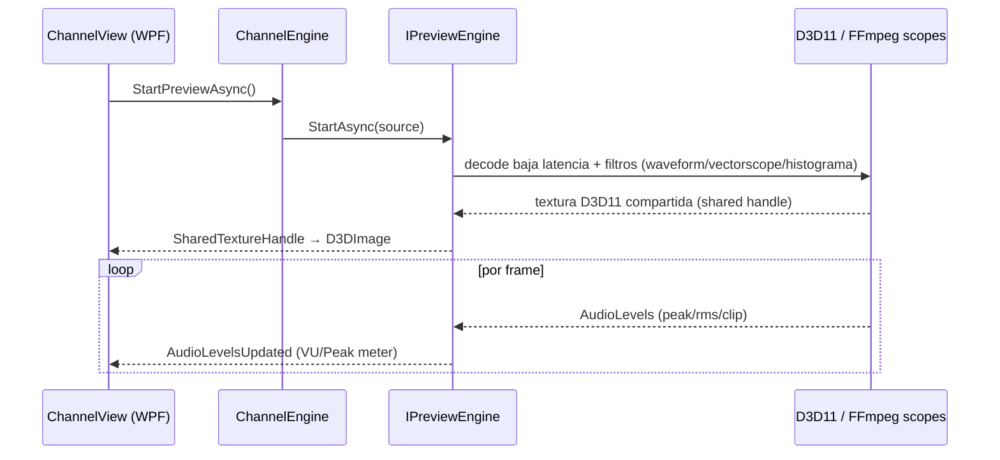
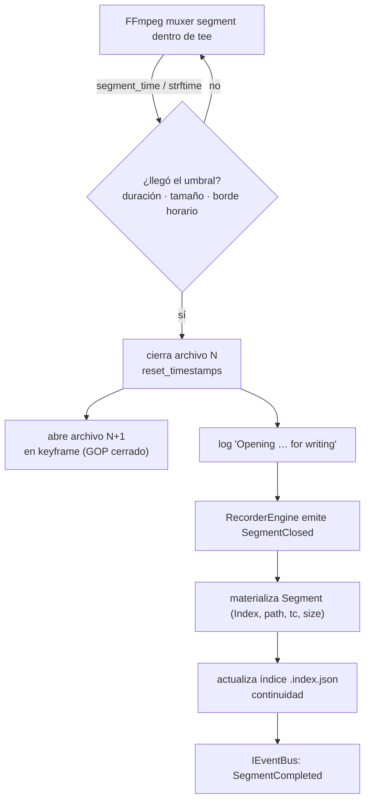
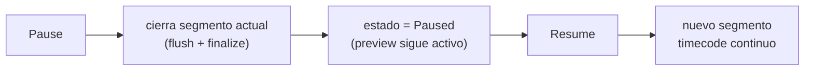
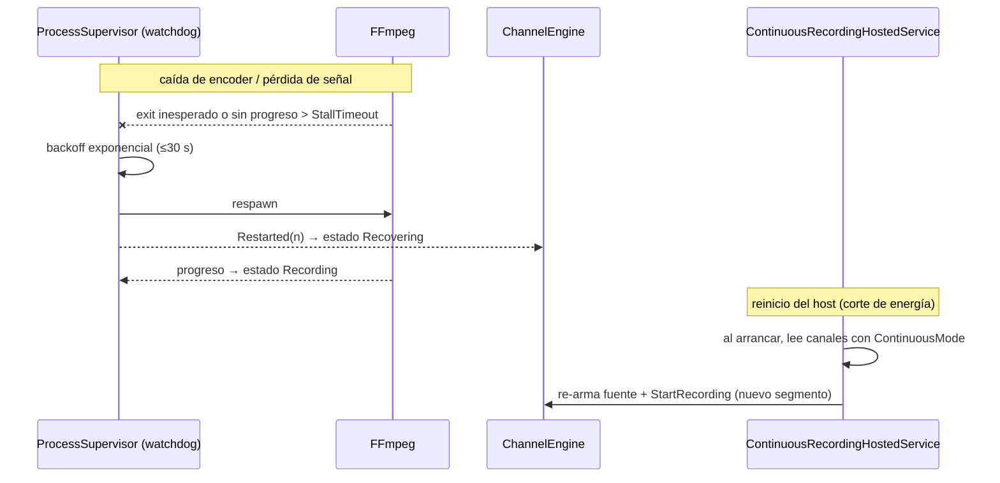

# 04 · Flujos y casos de uso

## Casos de uso principales

| Actor | Caso de uso | Comando/Query (CQRS) |
|-------|-------------|----------------------|
| Operador | Vincular fuente a un canal | `BindSource` |
| Operador | Iniciar / detener grabación | `StartRecordingCommand` / `StopRecordingCommand` |
| Operador | Pausar / reanudar | `PauseRecording` / `ResumeRecording` |
| Operador | Capturar screenshot | `CaptureSnapshotCommand` |
| Supervisor | Programar grabación | `ScheduleJobCommand` |
| Supervisor | Cambiar perfil/fuente en vivo | `SwitchProfile` / `SwitchSource` |
| Administrador | Definir retención / usuarios | `SetRetentionPolicy` / `ManageUsers` |
| Automatización | Consultar estado / historial | `GetChannelStatusQuery` / `GetRecordingHistoryQuery` |
| Sistema | Recuperar tras fallo | watchdog + `ContinuousRecordingHostedService` |

## Flujo de grabación

`Stop` invierte el flujo: `Supervisor` envía `q` por stdin (cierre ordenado que finaliza
los contenedores), se sella `EndedAt`/`EndTimecode`, se persiste la sesión y se publica
`RecordingStopped`.

## Flujo de preview

Claves de baja latencia: el preview usa su **propia ruta** de decode (no depende del encoder
de grabación), render por GPU con textura compartida (cero copia a CPU) y buffers mínimos.
Modos: `Preview`, `Program`, `Fullscreen`. Overlays: safe area, timecode, frame counter.

## Flujo de segmentación

Disparadores soportados (`SegmentationPolicy.Trigger`):

- **Duration** — `-segment_time` (p. ej. 900 s = 15 min, o 3600 s = 1 h).
- **Size** — corte por tamaño (p. ej. 5 GB) vía monitorización + `segment` con límite.
- **WallClock** — alineado a bordes de reloj con `strftime` (archivo nuevo en cada hora en punto).
- **Manual / Event** — corte forzado por operador o por la API/automatización.

El **GOP cerrado** garantiza que cada segmento empiece en keyframe → archivos independientes,
editables y sin dependencia del segmento anterior. `reset_timestamps=1` deja cada archivo con
timeline propia desde 00:00.

## Flujo de pausa / reanudación

FFmpeg no soporta pausa nativa. Semántica adoptada (file recording):

La continuidad de timecode se preserva escribiendo el TC de reanudación a partir del último
frame grabado, de modo que el índice de segmentos sigue siendo monotónico.

## Flujo 24/7 con auto-recuperación

Detalles de la estrategia completa en [05 · Resiliencia y GPU](05-resiliencia-y-gpu.md).
