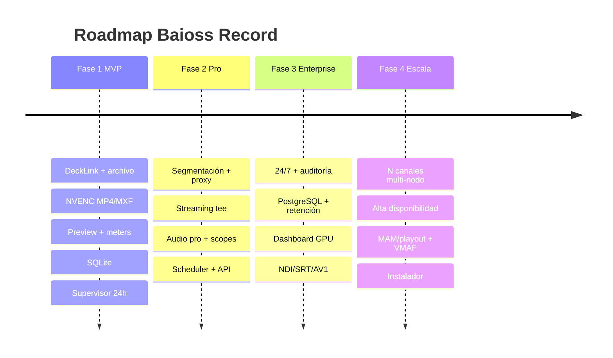

# 07 · Roadmap MVP → Enterprise

Cuatro fases. Cada una es un incremento desplegable; la estabilidad 24/7 se cuida desde la F1.

## Fase 1 — MVP (un camino feliz, sólido)

**Meta:** grabar de forma fiable 2 canales con preview básico.

- Captura: DeckLink SDI + archivo (las dos fuentes más comunes para validar el pipeline).
- Grabación: H.264/HEVC NVENC → MP4/MXF; Start/Stop; un proceso FFmpeg por canal.
- Supervisor con respawn + watchdog (resiliencia base desde el día 1).
- Preview de baja latencia (D3D11) + VU/Peak meter.
- Detección de señal (lock/no-signal, resolución, fps).
- Persistencia SQLite; sesiones y segmentos; logging Serilog.
- UI WPF de dos canales (tema oscuro) con transporte básico.

**Criterio de salida:** 24 h de grabación continua por canal sin intervención.

## Fase 2 — Profesional

**Meta:** features broadcast que esperan productoras y master control.

- Segmentación (duración/tamaño/horario) + índice + auto-merge + export timeline.
- Proxy H.264/H.265 en paralelo (escalado en GPU).
- Streaming simultáneo (SRT, RTMP, UDP) vía `tee`.
- Audio pro: channel mapping, gain, delay, normalización; silence/clipping detection.
- Timecode: embedded/LTC/VITC/system clock; drop/non-drop; burn-in opcional.
- Scopes: waveform, vectorscope, histograma; safe area; timecode/frame overlay.
- Scheduler (fecha/hora/CRON) y screenshots (manual/programado/thumbnail).
- Metadata export XML/JSON/CSV.
- REST API + WebSocket de eventos.

**Criterio de salida:** grabación + proxy + streaming concurrentes en 2 canales 1080p25.

## Fase 3 — Enterprise

**Meta:** operación 24/7 multi-operador con gobierno y escala.

- Modo continuo 24/7 con `ContinuousRecordingHostedService` y reconciliación post-reinicio.
- Roles (Admin/Supervisor/Operador), login, auditoría completa.
- PostgreSQL; gestión de almacenamiento (auto-delete, retención 7/30/90/custom, archivado).
- Dashboard de rendimiento (CPU/RAM/GPU/VRAM/Disco/Red + métricas por canal).
- NDI (entrada y salida), SRT listener/caller, RTP/MPEG-TS.
- AV1 NVENC; ProRes/DNxHD/DNxHR para flujos de post.
- Multi-monitor, docking panels, layouts guardables.
- Servicio Windows headless (operación sin sesión interactiva).

**Criterio de salida:** despliegue en estación real con SLA de disponibilidad.

## Fase 4 — Escala y ecosistema

**Meta:** de 2 canales a flota; integración con el ecosistema broadcast.

- N canales por nodo y orquestación multi-nodo (reparto por GPU/host).
- Alta disponibilidad: grabación redundante (A/B mirror), failover de fuente.
- Integraciones: MAM/playout, webhooks, control por protocolo de automatización.
- Calidad: VMAF para QC automático de proxies/streams; alarmas por degradación.
- Telemetría centralizada (Seq/Elastic/Grafana) y health checks.
- Empaquetado: instalador MSI/MSIX, licenciamiento, actualizaciones.

## Resumen visual

## Prioridades transversales (todas las fases)

1. **Estabilidad 24/7** — ningún feature entra si compromete la grabación continua.
2. **Baja latencia** — preview y monitoreo no deben penalizar la ruta de grabación.
3. **Uso eficiente de GPU** — un encode por canal, todo en VRAM, proxy escalado en GPU.
4. **Compatibilidad broadcast** — contenedores/códecs/timecode conformes a flujos profesionales.
