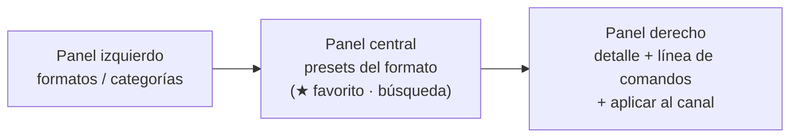
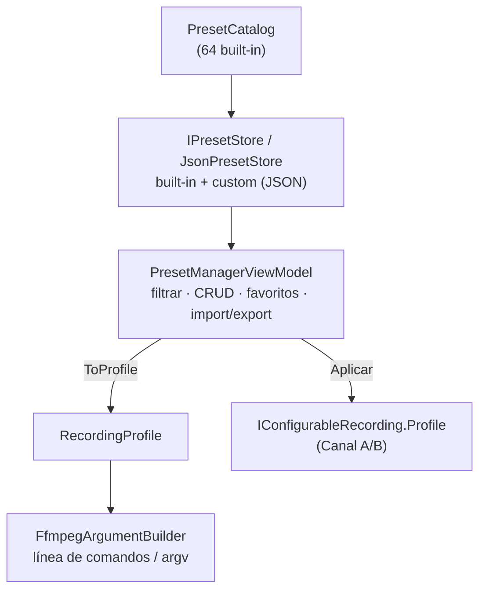

# 08 · Presets de grabación / encoding

Sistema de **presets** (formatos y perfiles preconfigurados) inspirado en Marsis Ingest: el
operador elige un formato profesional sin conocer los parámetros técnicos de FFmpeg. Cada
preset define la receta completa y **genera automáticamente su línea de comandos**.

## Interfaz de 3 paneles

Se abre desde la barra de título (**⚙ Presets de grabación**) → ventana
[`PresetManagerWindow`](../src/Baioss.Record.App/Presets/PresetManagerWindow.xaml).



- **Izquierda** — formatos: Todos, ★ Favoritos, MPEG-2, H.264, H.265/HEVC, DNxHD/DNxHR,
  ProRes, XDCAM, MXF OP1A, AVI, MKV, Audio, Streaming, Proxy, Archive.
- **Centro** — presets de la categoría, filtrados por la **búsqueda rápida**; estrella de favorito
  por fila; etiqueta "fábrica" en los built-in.
- **Derecha** — todos los parámetros del preset, la **línea de comandos FFmpeg** generada, y un
  selector de **Canal A/B** con el botón *Aplicar*.

Barra de herramientas: **Nuevo · Editar · Duplicar · Eliminar · Importar · Exportar**.

## Parámetros que define cada preset

| Parámetro | Campo | Mapeo FFmpeg |
|-----------|-------|--------------|
| Contenedor | `Container` | muxer `-f` (mp4/mov/mxf/mkv/mpegts/avi/mpeg/wav/mp3) |
| Códec de video | `VideoCodec` | `-c:v` (libx264, libx265, hevc/h264/av1_nvenc, prores_ks, dnxhd, mpeg2video) |
| Códec de audio | `AudioCodec` | `-c:a` (aac, pcm_s24le, libfdk_aac, libopus, libmp3lame, mp2) |
| Resolución | `Width`/`Height` | filtro `scale=W:H` (vacío = nativa) |
| FPS | `FrameRateNum/Den` | `-r N/D` (vacío = la de la fuente) |
| Bitrate | `VideoBitrateMbps` | `-b:v` |
| Max bitrate | `MaxBitrateMbps` | `-maxrate` + `-bufsize` (VBV) |
| GOP | `GopSize` | `-g` |
| Pixel Format | `PixelFormat` | `-pix_fmt` (yuv420p, yuv422p, *p10le; Auto = el del códec) |
| Audio Sample Rate | `AudioSampleRate` | `-ar` |
| Audio Channels | `AudioLayout` | `-ac` (1/2/6/8) |
| Audio Bitrate | `AudioBitrateKbps` | `-b:a` |
| Field Order | `ScanType` | `setfield`/`-field_order` (tt/bb) + `-flags +ilme+ildct` |
| Control de tasa | `RateControl` | CBR / VBR / CRF-CQ |

> El campo `AudioOnly` produce comandos sin video (`-vn`) para los presets de la categoría Audio.

## Catálogo de fábrica (64 presets)

[`PresetCatalog`](../src/Baioss.Record.Application/Presets/PresetCatalog.cs) — todos verificados
grabando material real (ver más abajo).

| Categoría | Presets |
|-----------|---------|
| **MPEG-2** | PS SD PAL · TS HD 1080i25 · TS SD PAL |
| **H.264** | HD 720p50 · FullHD 1080p25 · 1080i25 TS · 4K UHD 2160p50 · SD PAL · **59.94/60/50:** 1080p59.94 · 1080p60 · 1080p50 · 1080p29.97 · 1080p23.98 · 720p59.94 · 1080i59.94 TS · 4K 2160p59.94 |
| **H.265/HEVC** | FullHD 1080p25 · 4K UHD 2160p50 10-bit · **59.94:** 1080p59.94 · 4K 2160p59.94 10-bit |
| **DNxHD/DNxHR** | DNxHR HQ 1080p25 · DNxHR HQX 10-bit · DNxHD 1080i25 (MXF) · DNxHR HQ 1080p59.94 (MOV) |
| **ProRes** | 422 HQ 1080p25 · 422 HQ 4K 2160p25 · 422 HQ 1080p59.94 |
| **XDCAM** | HD422 1080i25 50 Mbps · HD 1080i25 35 Mbps |
| **MXF OP1A** | XDCAM HD422 50 (1080i25) · DNxHR HQ 1080p25 · **59.94 (NTSC):** XDCAM HD422 1080i59.94 · 1080p59.94 · 1080p29.97 · 1080p23.98 · 720p59.94 · 1080p60 · DNxHR HQ 1080i59.94 · DNxHR HQ 1080p59.94 · DNxHR HQX 1080p59.94 10-bit · **50 Hz (PAL):** XDCAM HD422 1080p50 · 720p50 · DNxHR HQ 1080p50 |
| **AVI** | H.264 1080p25 |
| **MKV** | H.264 1080p25 · HEVC 4K 10-bit |
| **Audio** | WAV PCM 48k 24-bit · AAC 256k (M4A) · MP3 320k |
| **Proxy** | H.264 540p · H.264 360p |
| **Archive** | HEVC 1080p CRF20 · ProRes 422 1080p |
| **Streaming** | IPTV H.264 720p TS (UDP) · RTMP H.264 1080p · SRT H.264 1080p |

## Línea de comandos generada (ejemplos reales)

[`FfmpegCommandPreview`](../src/Baioss.Record.Engine.FFmpeg/FfmpegCommandPreview.cs) produce
exactamente lo que ejecutará el motor, con entrada/salida simbólicas:

```text
# H.264 Broadcast · FullHD 1080p25
ffmpeg -hide_banner -progress pipe:1 -stats_period 1 -i <entrada> \
  -filter_complex "[0:v]scale=1920:1080[mainout]" -map "[mainout]" -map 0:a? \
  -c:v libx264 -preset veryfast -b:v 16000000 -maxrate 16000000 -bufsize 40000000 -g 50 \
  -pix_fmt yuv420p -c:a aac -ar 48000 -b:a 256000 -ac 2 -r 25/1 \
  -af ebur128=peak=true -movflags +faststart -f mp4 -y <salida>

# XDCAM HD422 · 1080i25 50 Mbps (MXF OP1A)
ffmpeg ... -filter_complex "[0:v]scale=1920:1080,setfield=mode=tff[mainout]" ... \
  -c:v mpeg2video -b:v 50000000 -minrate 50000000 -maxrate 50000000 -bufsize 100000000 -g 12 \
  -flags +ilme+ildct -pix_fmt yuv422p -c:a pcm_s24le -ar 48000 -ac 2 -field_order tt -f mxf -y <salida>

# MXF · XDCAM HD422 1080p59.94 50 (60000/1001 progresivo)
ffmpeg ... -filter_complex "[0:v]scale=1920:1080[mainout]" -map "[mainout]" -map 0:a? \
  -c:v mpeg2video -b:v 50000000 -minrate 50000000 -maxrate 50000000 -bufsize 100000000 -g 15 \
  -pix_fmt yuv422p -c:a pcm_s24le -ar 48000 -ac 2 -r 60000/1001 -f mxf -y <salida>

# Audio · WAV PCM 48k 24-bit (solo audio)
ffmpeg ... -i <entrada> -vn -map 0:a? -c:a pcm_s24le -ar 48000 -ac 2 -af ebur128=peak=true -f wav -y <salida>
```

## Arquitectura



- [`EncodingPreset`](../src/Baioss.Record.Application/Presets/EncodingPreset.cs) — modelo plano,
  serializable a JSON; `ToProfile()` lo traduce al `RecordingProfile` de dominio.
- [`JsonPresetStore`](../src/Baioss.Record.Infrastructure/Presets/JsonPresetStore.cs) — combina los
  built-in (solo lectura) con los personalizados; persiste estos y los favoritos en
  `data/presets.json` (junto a la base de datos).
- Al **Aplicar**, el preset inyecta un `RecordingProfile` completo en el canal vía
  `IConfigurableRecording.Profile`, conservando la identidad persistida del canal.

## CRUD, favoritos e import/export

- **Nuevo / Editar / Duplicar / Eliminar** — los built-in son de solo lectura; para personalizarlos
  se **duplican** (quedan como custom editables). El editor es
  [`PresetEditorWindow`](../src/Baioss.Record.App/Presets/PresetEditorWindow.xaml).
- **Favoritos** — la estrella marca cualquier preset (incluido un built-in); se persiste.
- **Importar / Exportar JSON** — intercambio entre equipos. Estructura exportada:

```json
[
  {
    "Name": "H.264 Broadcast · FullHD 1080p25",
    "Category": "H264",
    "Container": "Mp4",
    "VideoCodec": "H264x264",
    "Width": 1920, "Height": 1080,
    "FrameRateNum": 25, "FrameRateDen": 1,
    "VideoBitrateMbps": 16, "MaxBitrateMbps": 20, "GopSize": 50,
    "PixelFormat": "Yuv420p", "ScanType": "Progressive", "RateControl": "ConstantBitrate",
    "AudioCodec": "Aac", "AudioLayout": "Stereo", "AudioSampleRate": 48000, "AudioBitrateKbps": 256
  }
]
```

Los enums se serializan como texto (estables ante reordenamientos). Al importar, cada preset
recibe una identidad nueva como personalizado.

## Verificación

El smoke test [`tools/Baioss.Record.SmokeTest`](../tools/Baioss.Record.SmokeTest/Program.cs)
genera la línea de comandos de los 64 presets y **graba material real** con cada uno (≤ 1080p;
los 6 presets en 4K se omiten de la grabación):

```
Resultado grabación: 58 OK, 0 fallidos.
```

Cubre MPEG-2 PS/TS, H.264/265 (incl. **familia de cadencias 59.94/60/50/29.97/23.98** en MP4/TS),
DNxHR HQ/HQX, ProRes, XDCAM, **MXF OP1A (familias 59.94 y 50 Hz: 1080i/1080p/720p en XDCAM HD422 y
DNxHR)**, AVI, MKV, WAV/AAC/MP3, Proxy, Archive e IPTV/RTMP/SRT; todos producen archivos válidos
(verificados con `ffprobe`).

## Extender el catálogo

- **Nuevo preset de fábrica** → añadir un `Make(...)` en `PresetCatalog`.
- **Nuevo códec/contenedor** → ampliar los enums de dominio + `FfmpegCodecMap` (+ rama en
  `FfmpegArgumentBuilder` si requiere parámetros específicos).
- **Nuevo parámetro** → añadir el campo a `EncodingPreset` y `RecordingProfile`, y emitirlo en el builder.

> Nota: los presets de **Streaming** definen hoy el *encode* y el protocolo sugerido; el push real
> (SRT/RTMP/UDP por el muxer `tee`) se conecta como `StreamTarget` del perfil — ver
> [01 · Arquitectura](01-arquitectura.md) y el `BuildTeeTarget` del builder.
